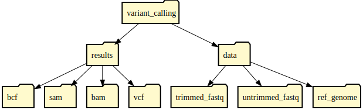
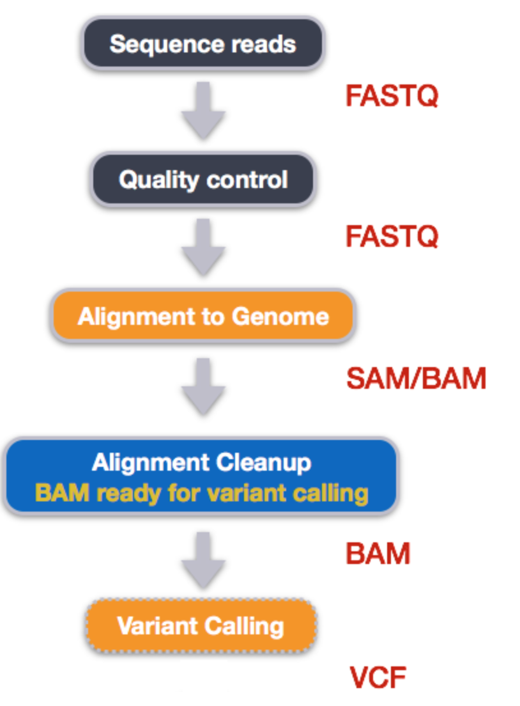

# Step 1: Setup & Introduction

This tutorial will walk you through the setup and background information necessary to begin the variant calling process.

---

## 📁 Directory Structure

Below is the structure of the directories used in this variant calling tutorial:

<figure markdown>
  { width="400" }
  <figcaption>Structure of the directories for the variant calling tutorial</figcaption>
</figure>

---

## 🧪 Command Line Cheat Sheet

Keep this reference handy as you go through the tutorial:

<figure markdown>
  { height="800" }
  <figcaption>Variant Calling Workflow Overview</figcaption>
</figure>

---

## 🧬 Background and Metadata

### What is Variant (or SNP) Calling?

Variant calling is the process of identifying and cataloging the differences between the observed sequencing reads and a reference genome. These differences are called **variants**, such as SNPs (Single Nucleotide Polymorphisms), insertions, deletions, etc.

---

### 🧭 Typical Variant Calling Workflow:

1. **Align reads** to the reference genome  
2. **Correct and refine** alignments  
3. **Determine variants** from the alignments  
4. **Filter** the resulting variants based on desired characteristics

<figure markdown>
  { width="230" height="300" }
  <figcaption>Overview of the Variant Calling Workflow</figcaption>
</figure>

---

### 📝 A Note on Terminology

In the variant calling process, you’ll encounter a variety of terms. These aren’t always used consistently in practice or across tools.

Throughout this tutorial, we’ll define key terms to help you navigate the workflow — but note that these are **practical definitions**, not necessarily the strict textbook versions.

---

👉 Ready? Continue to [Step 2 - Quality Control](./step2.md)
