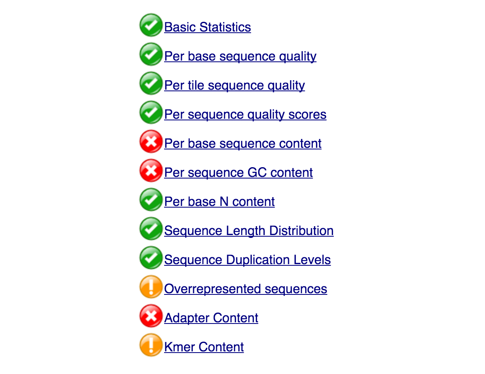
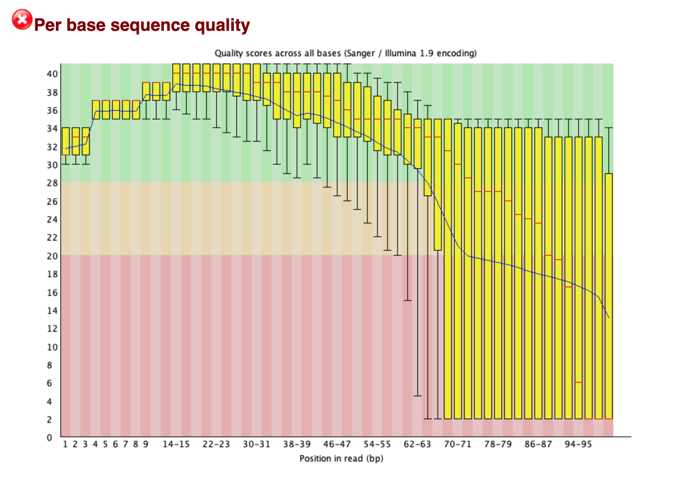
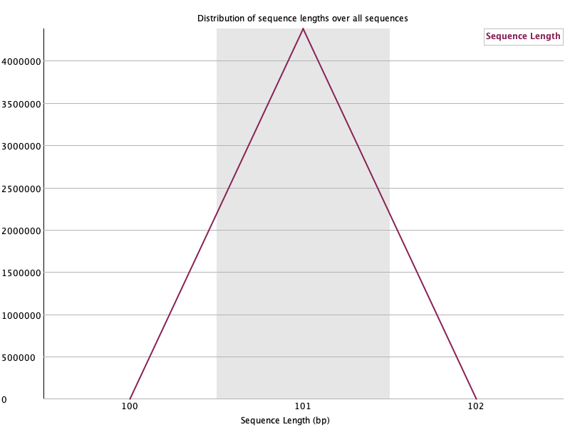
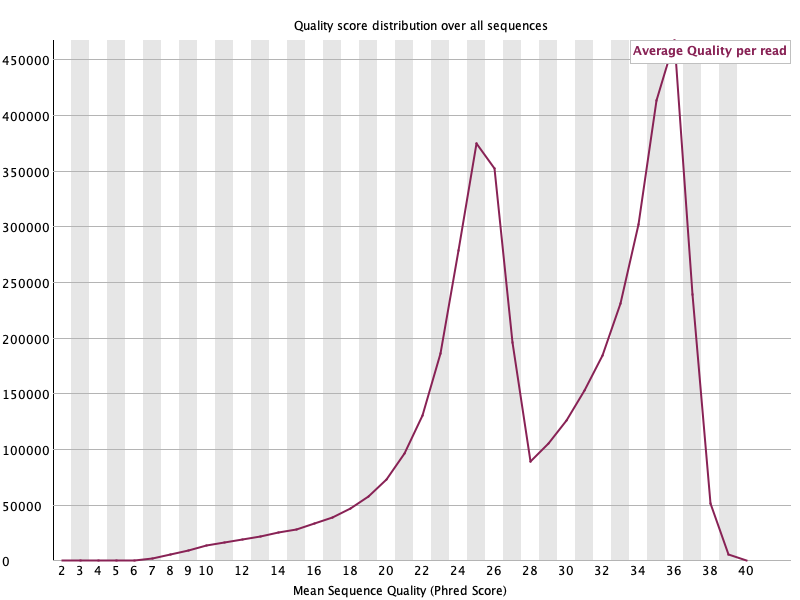

# Step 2: Assessing Read Quality

In this step, you'll download example FASTQ data, examine its format, run FastQC for quality control, and perform trimming using Trimmomatic.

---

	
1. Downloading SRA files:  
    * Make a directory to download fastq files:  
    `$ mkdir -p ~/variant_calling/data/untrimmed_fastq`  
    `$ cd ~/variant_calling/data/untrimmed_fastq`
    * Download fastq files:  
	`$ curl -O ftp://ftp.sra.ebi.ac.uk/vol1/fastq/SRR197/007/SRR1972917/SRR1972917_1.fastq.gz`   
	`$ curl -O ftp://ftp.sra.ebi.ac.uk/vol1/fastq/SRR197/007/SRR1972917/SRR1972917_2.fastq.gz`  
	`$ curl -O ftp://ftp.sra.ebi.ac.uk/vol1/fastq/SRR197/008/SRR1972918/SRR1972918_1.fastq.gz`  
	`$ curl -O ftp://ftp.sra.ebi.ac.uk/vol1/fastq/SRR197/008/SRR1972918/SRR1972918_2.fastq.gz`  
	`$ curl -O ftp://ftp.sra.ebi.ac.uk/vol1/fastq/SRR197/009/SRR1972919/SRR1972919_1.fastq.gz`  
	`$ curl -O ftp://ftp.sra.ebi.ac.uk/vol1/fastq/SRR197/009/SRR1972919/SRR1972919_2.fastq.gz`  
	`$ curl -O ftp://ftp.sra.ebi.ac.uk/vol1/fastq/SRR197/000/SRR1972920/SRR1972920_1.fastq.gz`  
	`$ curl -O ftp://ftp.sra.ebi.ac.uk/vol1/fastq/SRR197/000/SRR1972920/SRR1972920_2.fastq.gz`  
	
2. Let's take a look at one of our fastq files:
	* In order to view our the fastq file, we must decompress it:  
		`$ gunzip SRR1972917_1.fastq.gz`
	* We can view the first complete read in one of the files our dataset by using head to look at the first four lines:  
		`$ head -n 4 SRR1972917_1.fastq`   
    
        * A FASTA-like header, but instead of the > symbol it uses the @ symbol. This is followed by an ID and more optional text, similar to the FASTA headers  
        * The second section contains the measured sequence (typically on a single line), but it may be wrapped until the + sign starts the next section  
        * The third section is marked by the + sign and may be optionally followed by the same sequence id and header as the first section
        * The last line encodes the quality values for the sequence in section 2 and must be of the same length as section 2. It should also be wrapped the same way as the section 2

  
```
@SRR1972917.1 1/1
TCCGTGGGGCTGGTACGACAGTATCGATGAGGGTGGACGCTTCAAGGTCAAGCGTATACAGGTCAACCCCAAAGCTAGCCTGAGCCTTCAGAAACACCACC  
+  
@CCFDDFFHGHHHGIJJIIJJJJGJJJJGIJIJJFIJJJIIJJJJHHFHHFFFFAADEFEDDDDDDDDDDDD??CCCDDDDDDCCCDDCCCDD:?CABDDB
``` 


   * Each quality score represents the probability that the corresponding nucleotide call is incorrect  
   * This quality score is logarithmically based, so a quality score of 10 reflects a base call accuracy of 90%, but a quality score of 20 reflects a base call accuracy of 99%
   * These probability values are the results from the base calling algorithm and depend on how much signal was captured for the base incorporation  


```
Quality encoding: !"#$%&'()*+,-./0123456789:;<=>?@ABCDEFGHIJ
             |         |         |         |         |  
Quality score: 01........11........21........31........41
```

* Compress Fastq file again:  

`$ gzip SRR1972917_1.fastq`  

1. Assessing read quality using FastQC
    * FastQC has a number of features which can give you a quick impression of any problems your data may have, so you can take these issues into consideration before moving forward with your analyses   
    * Rather than looking at quality scores for each individual read, FastQC looks at quality collectively across all reads within a sample  
    * The x-axis displays the base position in the read, and the y-axis shows quality scores  
    * For each position, there is a box-and-whisker plot showing the distribution of quality scores for all reads at that position  
    * The horizontal red line indicates the median quality score and the yellow box shows the 1st to 3rd quartile range  
    * This means that 50% of reads have a quality score that falls within the range of the yellow box at that position  
    * The whiskers show the absolute range, which covers the lowest (0th quartile) to highest (4th quartile) values  
    *The plot background is also color-coded to identify good (green), acceptable (yellow), and bad (red) quality scores  


    `$ fastqc -h`  
    `$ fastqc *.fastq*`  

    * Output should look like this:  
```
application/gzip   
    Started analysis of SRR1972917_1.fastq.gz  
    Approx 5% complete for SRR1972917_1.fastq.gz  
    Approx 10% complete for SRR1972917_1.fastq.gz  
    Approx 15% complete for SRR1972917_1.fastq.gz  
    Approx 20% complete for SRR1972917_1.fastq.gz  
    Approx 25% complete for SRR1972917_1.fastq.gz  
    Approx 30% complete for SRR1972917_1.fastq.gz  
    Approx 35% complete for SRR1972917_1.fastq.gz  
    Approx 40% complete for SRR1972917_1.fastq.gz  
    Approx 45% complete for SRR1972917_1.fastq.gz  
    Approx 50% complete for SRR1972917_1.fastq.gz  
    Approx 55% complete for SRR1972917_1.fastq.gz  
    Approx 60% complete for SRR1972917_1.fastq.gz  
    Approx 65% complete for SRR1972917_1.fastq.gz  
    Approx 70% complete for SRR1972917_1.fastq.gz  
    Approx 75% complete for SRR1972917_1.fastq.gz  
    Approx 80% complete for SRR1972917_1.fastq.gz  
    Approx 85% complete for SRR1972917_1.fastq.gz  
    Approx 90% complete for SRR1972917_1.fastq.gz  
    Approx 95% complete for SRR1972917_1.fastq.gz  
    Analysis complete for SRR1972917_1.fastq.gz
```

   * Lets now look at the files created by FastQC:  
    `$ ls -al` 

   * For each input FASTQ file, FastQC has created a .zip file and a .html file  
   * The .zip file extension indicates that this is actually a compressed set of multiple output files   
   * The .html file is a stable webpage displaying the summary report for each of our samples  
   * We want to keep our data files and our results files separate, so we will move these output files into a new directory within our results/ directory  
    
`$ cd ~/variant_calling`  
`$ mkdir -p results/fastqc_untrimmed_reads`  
`$ mv ~/variant_calling/data/untrimmed_fastq/*.zip ~/variant_calling/results/fastqc_untrimmed_reads`  
`$ mv ~/variant_calling/data/untrimmed_fastq/*.html ~/variant_calling/results/fastqc_untrimmed_reads`  
`$ cd ~/variant_calling/results/fastqc_untrimmed_reads`  

### We can now open the .html file to view the FastQC results: 


<figure>
    
    <figcaption>FastQC Spotlight Visualization</figcaption>
</figure>

#### Should I be worried about the “stoplight” symbols?

Usually not.

When FastQC runs, it generates “stoplight” icons for each analysis having “pass,” “warning,” and “error” symbols. Most of the time, these symbols are not meaningful. They were developed for only a particular class of samples and library preparation methods and just for certain types of instruments.

Although if most or all your stop-light icons are red, then you probably have a data problem.


<figure>
    
    <figcaption>FastQC output of SRR1972917_1.fastq.gz</figcaption>
</figure>

#### What does the sequence quality visualization tell us?
The simplest way to snapshot the quality of a sequencing run is via a chart that plots the error likelihood at each position averaged over all measurements.

The vertical axis is the FASTQ scores that represent error probabilities:

* 10 corresponds to 10% error (1/10)
* 20 corresponds to 1% error (1/100)
* 30 corresponds to 0.1% error (1/1,000)
* 40 corresponds to one error every 10,000 measurements (1/10,000) that is an error rate of 0.01%

The three-colored bands illustrate the typical labels that we assign to these measures: reliable (30-40, green), less reliable (20-30, yellow) and error-prone (1-20, red). The yellow boxes contain 50% of the data, the whiskers indicate the 75% outliers.


<figure>
    
    <figcaption>Sequence lengths histogram of SRR1972917_1.fastq.gz</figcaption>
</figure>

The sequence length distribution shows how many sequences of each length the data contains. For fixed read length instruments, like the Illumina sequencer, all read lengths are the same. For long read technologies like the PacBio and MinION, the distribution can be a lot more varied.

<figure>
    
    <figcaption>Sequence quality histogram of SRR1972917_1.fastq.gz</figcaption>
</figure>

Another way to visualize data quality is to generate histograms of the average qualities. The horizontal scales are the quality scores; the vertical axis indicates the number of reads of that quality.

---

👉 Ready? Continue to [Step 3 - Trimming and Filtering](../step3/)
