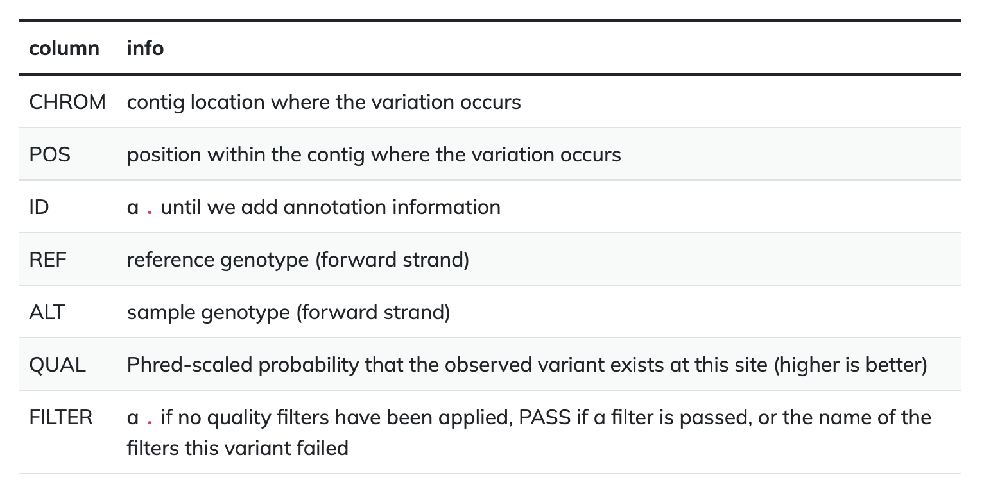
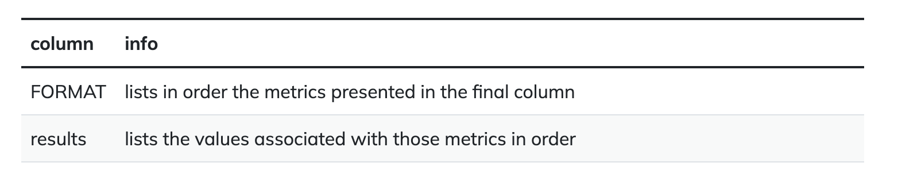
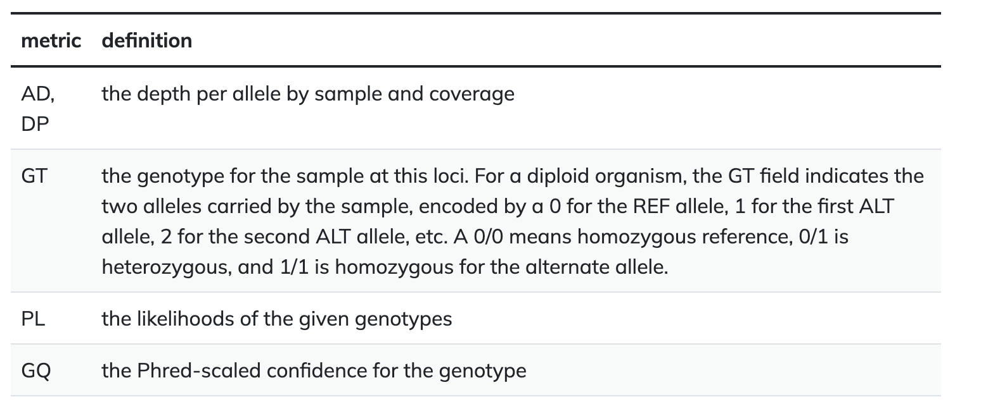

# Step 5: Variant Calling

#### A variant call is a conclusion that there is a nucleotide difference vs. some reference at a given position in an individual genome or transcriptome, often referred to as a Single Nucleotide Variant (SNV)  
#### The call is usually accompanied by an estimate of variant frequency and some measure of confidence  
#### Similar to other steps in this workflow, there are a number of tools available for variant calling  
#### We will be using [bcftools](https://samtools.github.io/bcftools/bcftools.html), but there are a few things we need to do before actually calling the variants  

1. Calculate the read coverage of positions in the genome  
   `$ bcftools mpileup -O b -o results/bcf/SRR1972917_raw.bcf -f data/ref_genome/KJ660346.2.fasta results/bam/SRR1972917.aligned.sorted.bam `  

2. Detect the single nucleotide variants (SNVs)  
    * Identify SNVs using bcftools call. We have to specify ploidy with the flag `--ploidy`, which is one for our Ebola genome. `-m` allows for multiallelic and rare-variant calling, `-v` tells the program to output variant sites only (not every site in the genome), and `-o` specifies where to write the output file:  
    `$ bcftools call --ploidy 1 -m -v -o results/vcf/SRR1972917_variants.vcf results/bcf/SRR1972917_raw.bcf`   

3. Filter and report the SNV variants in variant calling format (VCF)
    * Filter the SNVs for the final output in VCF format, using vcfutils.pl:  
    `$ vcfutils.pl varFilter results/vcf/SRR1972917_variants.vcf  > results/vcf/SRR1972917_final_variants.vcf`  

4. Explore the VCF format:  
    `$ less -S results/vcf/SRR1972917_final_variants.vcf` 

    Or you can use the `code` command to open the vcf file with VS code:  
    `$ code results/vcf/SRR1972917_final_variants.vcf`   

    * You will see the header (which describes the format), the time and date the file was created, the version of bcftools that was used, the command line parameters used, and some additional information  
    * The first few columns represent the information we have about a predicted variation:  
<figure>
    
</figure>

   * The last two columns contain the genotypes and can be tricky to decode:  
<figure>
    
</figure>

   * For our file, the metrics presented are GT:PL:GQ:  
<figure>
    
</figure>
