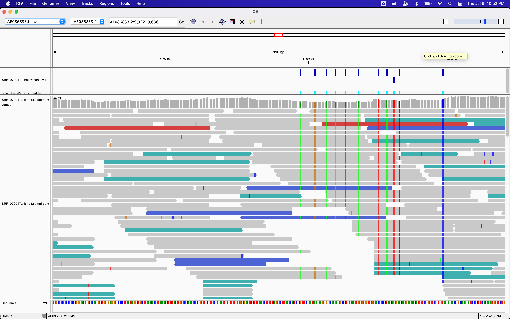

# Step 6: Visualizing the Results

#### It is often instructive to look at your data in a genome browser  
#### Visualization will allow you to get a “feel” for the data, as well as detecting abnormalities and problems  
#### Also, exploring the data in such a way may give you ideas for further analyses  
#### As such, visualization tools are useful for exploratory analysis  
#### We will describe two different tools for visualization: a light-weight command-line based one and the Broad Institute’s [Integrative Genomics Viewer (IGV)](https://igv.org/doc/desktop/#) which requires software installation and transfer of files

1. In order for us to visualize the alignment files, we will need to index the BAM file using samtools:  
    `$ samtools index results/bam/SRR1972917.aligned.sorted.bam`  
2. Viewing with `tview`
    * In order to visualize our mapped reads, we use tview, giving it the sorted bam file and the reference file:  
    `$ samtools tview results/bam/SRR1972917.aligned.sorted.bam data/ref_genome/KJ660346.2.fasta`  

    * The first line of output shows the genome coordinates in our reference genome. The second line shows the reference genome sequence  
    * The third line shows the consensus sequence determined from the sequence reads. 
    * A `.` indicates a match to the reference sequence, so we can see that the consensus from our sample matches the reference in most locations   
    * If that was not the case, we should probably reconsider our choice of reference  
    * Below the horizontal line, we can see all of the reads in our sample aligned with the reference genome  
    * Only positions where the called base differs from the reference are shown  
    * You can use the arrow keys on your keyboard to scroll or type `?` for a help menu   
    * To navigate to a specific position, type `g`  
    * A dialogue box will appear  
    * In this box, type the name of the “chromosome” followed by a colon and the position of the variant you would like to view (e.g. for this sample, type CP000819.1:50 to view the 50th base. Type `Ctrl^C` or `q` to exit tview  
  
3. Viewing with IGV
    #### IGV is a stand-alone browser, which has the advantage of being installed locally and providing fast access. Web-based genome browsers, like Ensembl or the UCSC browser, are slower, but provide more functionality  
    #### They not only allow for more polished and flexible visualization, but also provide easy access to a wealth of annotations and external data sources  
    #### This makes it straightforward to relate your data with information about repeat regions, known genes, epigenetic features or areas of cross-species conservation, to name just a few   
  
    1. Open IGV  
    2. Load our reference genome file (KJ660346.2.fasta) into IGV using the “Load Genomes from File…” option under the “Genomes” pull-down menu  
    3. Load our BAM file (SRR1972917.aligned.sorted.bam) using the “Load from File…” option under the “File” pull-down menu  
    4. Do the same with our VCF file (SRR1972917_final_variants.vcf)  

    <figure>
    
    </figure>

    * There should be two tracks: one coresponding to our BAM file and the other for our VCF file  
    * In the VCF track, each bar across the top of the plot shows the allele fraction for a single locus  
    * The second bar shows the genotypes for each locus in each sample  
    * We only have one sample called here, so we only see a single line  
    * Dark blue = heterozygous, Cyan = homozygous variant, Grey = reference  
    * Filtered entries are transparent  
    * Zoom in to inspect variants you see in your filtered VCF file to become more familiar with IGV  
    * See how quality information corresponds to alignment information at those loci

    ---

👉 Ready? Continue to [Step 7 - Automating a Variant Calling Workflow](./step6.md)